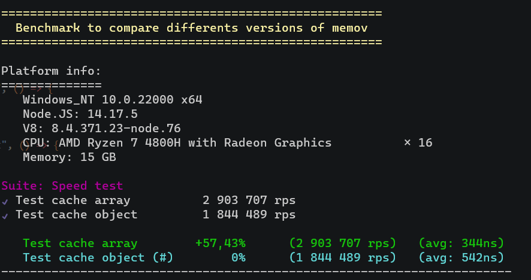

# Memov


Memoize to cache function results for natif javascript and vuejs.

## Features
- Async support
- Create your own configuration
- Debug you memo to see it working
- Define te max cache size and cache call
- Work with first arguments and don't care about other
- Define a method to make arguments corresponding

## 🎉 Update

See [CHANGELOG](./CHANGELOG.md)

## 💻 Installation

- To work with object insteadof array import "memov-obj" from dist directory

```
$ npm i memov
```

Try it in the browser

```html
<script src="https://unpkg.com/memov@1.0.5/dist/memov.js" type="text/javascript"></script>
```

## 📚 Usage

Simple example

```js
const memov = require("memov");

/**
 * Create a memov configuration
 * Note: see below the differents options to configure one instance of memov
*/
const _m = new memov();

const addition = _m.useMemo(function(a,b){
    return a + b;
});

addition(5,5) //10
addition(5,5) //10 - An other time but calculated from the cache
addition(5,6) //11
addition(5,5) //10 - Still from the cache
```

Also

```js
const _m = new memov();
const useMemo = _m.useMemo.bind(_m);

const addition = useMemo(function(a,b){
    return a + b;
});

```

Vue.js

```html
<template>
    <input type="text" v-model="val1">
    <input type="text" v-model="val2">
    <button @click="additionHandler">Add</button>
    <p>Result: {{ result }}</p>
</template>
<script>
import memov from "memov";

const _m = new memov({ debug: true });

export default {
    name: "MemovTest",

    data(){
      return {
        val1: 0,
        val2: 0,
        result: 0
      }
    },

    methods: {
        addition: _m.useMemo((a, b) => {
            return a + b;
        }),

        additionHandler(){
          this.result = this.addition(this.val1, this.val2)
        }
    }
}
</script>
```

## Clear cache

Here is how to clear all the cache or only for specifics arguments

```js
const _m = new memov({ argumentsLength: 2 });

const addition = _m.useMemo(function(a,b){
    return a + b;
});

addition.clearAll(); //clear all the cache
addition.clear(8,8); //clear cache for specifics arguments

addition(8,8);
addition(8,9);
addition(9,9);
addition(8,8,7); //cache hit
addition(8,9,8,8);; //cache hit

addition.clear(8,8,10);

addition(8,8);
addition(8,9); //cache hit

addition.clearAll();

//no cache hit for all
addition(8,8);
addition(8,9);
addition(9,9);
```

## Configuration

**Note:** you can combine all options

### isEqual

This method allow you to define when arguments are equals to stored arguments in cache.

```js
const _m = new memov({ 
    isEqual: (argumentsCache, args) => 
        argumentsCache[0]?.type === args[0]?.type 
})

const greeting = _m.useMemo(function(obj){
    if(obj.type === "morning") {
        return "Good Morning !";
    }
    return "Hey !";
})

greeting({type: "morning"})
greeting({type: "morning", date: "22/05/2022"}) //cache hit: Good Morning !
```

### maxCacheSize

This option allow you to set the max size of the cache. For example if you set up it at 3 and call the function with 4 differents parameters the first one will not work anymore.

```js
const _m = new memov({ 
    maxCacheSize: 2
})

const addition = _m.useMemo(function(a, b){
    return a + b;
});

addition(5,5);
addition(5,5); //cache hit

addition(5,6);
addition(5,6); //cache hit

addition(5,7);
addition(5,7); //cache hit

addition(5,5); //not working anymore, the function is evaluate an other time
```

### maxCacheCall

This option allow you to set the max call you can do on a cache.

```js
const _m = new memov({ 
    maxCacheCall: 2
})

const addition = _m.useMemo(function(a, b){
    return a + b;
});

addition(5,5);
addition(5,5); //cache hit
addition(5,5); //cache hit
addition(5,5); //not working anymore, the function is evaluate an other time
```

### argumentsLength

This option allow you to only work with the "x" first arguments and don't care about the other.

```js
const _m = new memov({ 
    argumentsLength: 2
})

const addition = _m.useMemo(function(a, b){
    return a + b;
});

addition(5,5);
addition(5,5); //cache hit
addition(5,5,6,...); //cache hit

addition(5,6,7,8);
addition(5,6); //cache hit
addition(5,6,9); //cache it
```

### debug

This option allow you to test your memo and display other informations

```js
const _m = new memov({ 
    debug: true
})

const addition = _m.useMemo(function(a, b){
    return a + b;
});

addition(5,5);
/*
{
    type: "function",
    count: 0,
    arguments: [5,5],
    response: 10
}
*/
addition(5,5); //cache hit
/*
{
    type: "cache",
    count: 1,
    arguments: [5,5],
    response: 10
}
*/

_m.debug = false; //disabling the debug mode
```

## Async

Working with async have never that easy

```js
const _m = new memov();

const addition = _m.useMemo(async function(a, b){
    return a + b;
});

await addition(5,5);
await addition(5,5); //cache hit: 10
```

In debug mode

```js
const _m = new memov({ debug: true });

const addition = _m.useMemo(async function(a, b){
    return a + b;
});

await (addition(5,5).response);
await (addition(5,5).response); //cache hit: 10
```

## Test

```
$ npm run test
```

## Benchmark

Test about working with objects is better or with array ?

